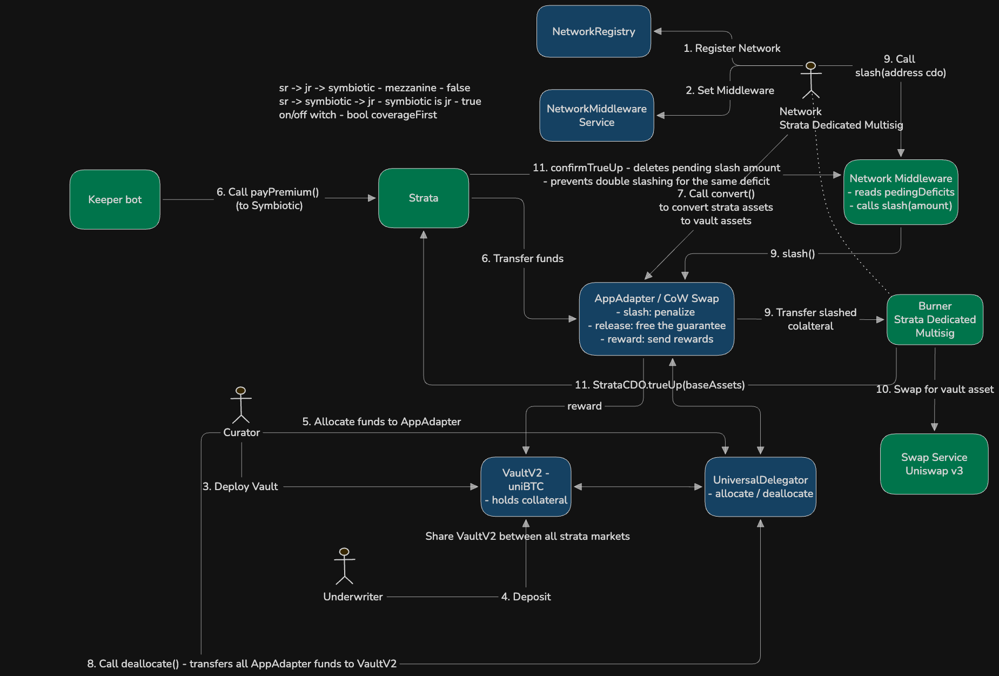

# Strata × Symbiotic Coverage Integration

Symbiotic underwriters post collateral (uniBTC) in a shared VaultV2. Strata pays them a premium
and, when a Strata market takes a loss that would reach the Senior tranche, slashes that collateral
to make Senior whole. It is a bonded backstop, not co-mingled tranche capital — the coverage lives
outside the CDO pool and re-enters only via the slash -> multisig -> true-up path.

Coverage is **mezzanine**: a loss is absorbed Junior -> reserve -> Symbiotic -> Senior. Symbiotic
only engages for the portion that would otherwise cut into Senior; Junior remains the first-loss
tranche. (Valuation loss from a base-asset depeg is out of scope — Junior absorbs it.)

One Symbiotic vault + one AppAdapter is shared across all Strata markets; the middleware keeps a
per-market registry keyed by CDO address and nets shared capacity across markets.

## Flow

## Contracts

- **`NetworkMiddleware`** — the only custom contract; also the shared insurance pool
  (`IInsurancePool`). It exposes:
  - `request(cdo, lossAmount)` — **view**. Returns how much of a loss the pool can currently cover
    for a market, in that market's base asset. Bounded by the adapter's slashable stake minus
    coverage already committed to every other market (`_committedVault()`), so simultaneous
    multi-market stress cannot over-commit the shared stake. Reserves nothing and slashes nothing.
  - `slash(cdo)` — owner-gated. Reads the market's outstanding `insuranceAmount`, converts it to
    vault asset (plus a per-market `bufferBps` to pre-fund the true-up swap discount), and slashes
    the AppAdapter. `pendingTrueUp` excludes deficit already slashed so the same shortfall is never
    slashed twice.
  - `confirmTrueUp(cdo, amount)` — called by the CDO during `trueUp` (or the owner as fallback);
    clears the in-flight amount.
  - Registry: `setMarket`. Upgradeable / Ownable2Step / Pausable.
- **`OracleAdapter` / `IOracleAdapter`** — prices base assets and the vault asset (uniBTC) in a
  common quote so claims can be sized in vault-asset terms (`_toVaultAsset` / `_toBaseAsset`).
- **`IAppAdapter` / `IStrataAccounting` / `INetworkMiddleware` / `IInsurancePool`** — trimmed local
  interfaces, so the integration does not modify the core `IAccounting`.

The Strata-side hooks live in the accounting/CDO contracts: `Accounting` (and `DiscreteAccounting`,
`DYSAccounting`) track `premiumNav` and `insuranceAmount` and hold `networkMiddleware`; `StrataCDO`
exposes `payPremium`, `trueUp`, and `setNetworkMiddleware`.

## Premium

`premiumBps` skims a share of realized gains into a separate `premiumNav` bucket (threaded through
the accounting split like the reserve; it never absorbs losses). `payPremium` sweeps the accrued
premium — in the strategy share token — down one of two routes:

- **Automatic:** to the AppAdapter, which `convert()`s it to the vault asset; a `deallocate` then
  pushes it into the Symbiotic vault so underwriter shares appreciate (no shares minted).
- **Manual:** to a dedicated multisig, which deposits it into the Symbiotic vault directly as the
  Strata underlying asset.

Premium is discretionary (Symbiotic gives full flexibility) — there is no fixed accrual schedule.

## Loss coverage: the `insuranceAmount` model

All three accounting variants (`Accounting`, `DiscreteAccounting`, `DYSAccounting`) share one model.
Inside the NAV split, when a loss overflows Junior + reserve toward Senior:

1. The Senior-bound remainder is offered to the pool via `_requestCoverage(loss)` ->
   `IInsurancePool.request()`. The covered portion is subtracted from the loss so Senior is **held
   whole**, and booked to `insuranceAmount` (a claim, not tranche capital).
2. The identity `navT1 + insuranceAmount == jrt + srt + reserve + premium` holds on every path and
   guards the split — a threading bug reverts with `InvalidNavSplit`.
3. A later **recovery gain first unwinds** the outstanding claim (self-healing) before any gain is
   distributed to tranches, reserve, or premium.
4. `trueUp(baseAssets)` settles the claim once the slashed funds are injected: it raises `nav`,
   decrements `insuranceAmount` by the settled amount, credits no tranche (Senior is already whole),
   and is never re-detected as a fresh gain.

The tranche carries no book loss (Senior stays whole from the moment of the loss); the claim simply
tracks the coverage owed until the slash -> true-up lands, since external coverage capital cannot
arrive atomically with the loss.
